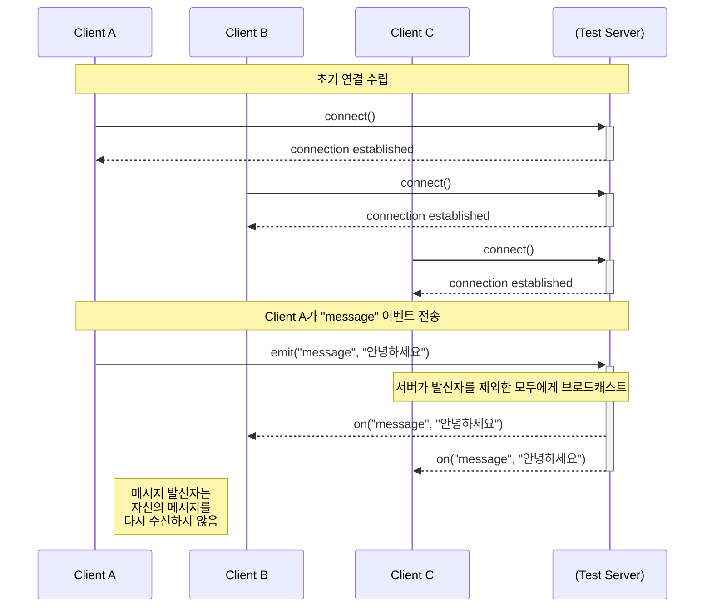

# SocketIOBasic

## 프로젝트 소개

- iOS 앱 프로젝트로 로컬에서 실행되는 Node.js 서버와 통신하며,<br>
`Socket.IO-Client-Swift` 라이브러리의 기본적인 소켓 연결, 메시지 송수신 등<br>
기본 사용법 및 이벤트 처리 방식을 학습하기 위한 개인 학습 프로젝트입니다.

## 주요 기능

- 텍스트 메시지 입력 및 서버로 전송 (`emit`)
- 서버로부터 브로드캐스트된 메시지 수신 및 화면에 표시 (`on`)

## 개발환경

| 구분 | 비고 |
|-------------|--------------------------------------|
| Swift 6.1.2 | iOS 앱 개발을 위한 프로그래밍 언어 |
| Xcode 16.4 | iOS 앱 개발을 위한 공식 IDE |
| iOS 16.6 | Target OS 버전 |

## 사용라이브러리

| 구분 | 비고 |
|--------|-------------------------------------|
| [Socket.IO-Client-Swift 6.1.1](https://github.com/socketio/socket.io-client-swift) | 클라이언트와 서버 간의 저지연 , 양방향 , 이벤트 기반 통신을 가능하게 하는 네트워크 라이브러리 |

## Node.js 서버
프로젝트내 socket-server 폴더에 포함되어 있으며, 로컬 환경에서 실행됩니다.<br>
서버는 Socket.IO를 이용하여 간단한 메시지 중계 기능을 수행합니다.

## 서버 실행 방법

```bash
cd socket-server
npm install
npm start
```

서버는 기본적으로 http://localhost:8080 에서 동작하며, Node.js 25.1.0 환경에서 정상 동작을 확인했습니다.

## 통신 특징
서버 중계형 N대 N 브로드캐스트로, 한 클라이언트가 메시지를 보내면 서버가 이를 받아 다른 모든 클라이언트에게 전파하는 방식으로 구현되어있습니다.<br>
서버에서 `socket.broadcast.emit()`을 사용하여, 메시지를 보낸 클라이언트를 제외한 모든 클라이언트에게만 메시지를 전달합니다.



- 전처리문을 통한 분기로 시뮬레이터 ↔ 시뮬레이터, 시뮬레이터 ↔ 실기기, 실기기 ↔ 실기기 간 통신 가능

```swift
#if targetEnvironment(simulator)
private let urlString = "http://localhost:8080"
#else
private let urlString = "http://<Mac IP>:8080"
#endif
```

## 실제 동작


## 프로젝트 구조

```
.
├── README.md
├── socket-server      # 클라이언트 메시지를 중계하는 로컬 테스트 서버
│   ├── package-lock.json
│   ├── package.json
│   ├── README.md
│   └── server.js
├── SocketIOBasic
│   ├── App      # 앱 생명주기 및 설정 관련 파일
│   │   ├── AppDelegate.swift
│   │   ├── Assets.xcassets
│   │   ├── Info.plist
│   │   └── SceneDelegate.swift
│   └── MainView      # 메인 화면 관련 파일 (MVVM)
│       ├── MainView.swift             # UI 구성 요소
│       ├── MainViewController.swift   # View와 ViewModel을 연결
│       └── MainViewModel.swift        # 소켓 통신 및 비즈니스 로직 담당
└── SocketIOBasic.xcodeproj
```
